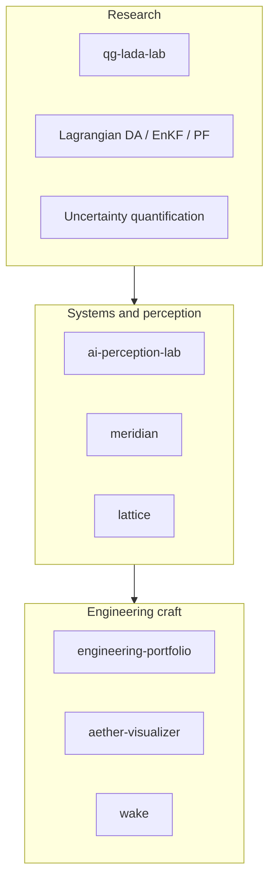

# Ahmad Droobi

Graduate Research Assistant at the **University of Calgary** (Schulich School of Engineering), working with [Prof. Mustafa Mohamad](https://profiles.ucalgary.ca/mustafa-mohamad) on **scientific machine learning**, **Lagrangian data assimilation**, and **uncertainty quantification** for turbulent geophysical flow.

I reconstruct high-dimensional Eulerian fields from sparse, noisy Lagrangian tracers — the same kind of measurement you actually get from the ocean and atmosphere — and I build the numerical and software systems that make those filters inspectable.

<p>
  <a href="https://ucalgary.scholaris.ca/items/b4a3d3b9-4fbf-4d1e-8e1e-80c71c009825">Thesis (2025)</a>
  · <a href="https://privatedro.github.io/">Academic site</a>
  · <a href="https://profiles.ucalgary.ca/ahmad-droobi">UCalgary profile</a>
  · <a href="https://scholar.google.com/citations?user=H-3pF00AAAAJ">Google Scholar</a>
  · <a href="https://ahmaddroobi99.github.io/">Portfolio</a>
  · <a href="https://x.com/AhmadDroobi99">X</a>
</p>

---

## Current work

**MSc, University of Calgary (2025)**  
*Data-Driven Filtering Techniques for Turbulent Flow Models (A Lagrangian Data Assimilation Approach)*  
[prism.ucalgary.ca](https://ucalgary.scholaris.ca/items/b4a3d3b9-4fbf-4d1e-8e1e-80c71c009825)

The thesis develops a hybrid Ensemble Kalman / Particle filter (WHERE) for barotropic quasi-geostrophic flow, recovering Eulerian energy spectra from Lagrangian drifters. The public lab that demonstrates the same operators in the browser is [`qg-lada-lab`](https://github.com/ahmaddroobi99/qg-lada-lab).

**BSc Computer Engineering**, An-Najah National University (Jan 2023), supervised by [Dr. Raed Qadi](https://staff.najah.edu/en/profiles/3034/).

```
Observations (Lagrangian drifters)
        ↓
  QG barotropic model   q = ∇²ψ − μψ
        ↓
  Spectral Helmholtz inversion
        ↓
  Localized stochastic EnKF  (+ optional EnKF–PF hybrid)
        ↓
  Reconstructed Eulerian field  →  spectra, XCOR, visualization
```

---

## Featured work

Original public repositories only. Forks of upstream libraries are not listed here.

| Repository | What it is |
|---|---|
| **[qg-lada-lab](https://github.com/ahmaddroobi99/qg-lada-lab)** | Interactive barotropic QG Lagrangian DA lab. Spectral twin + localized EnKF (thesis Algorithm 5) with a committed Python solver (N = 32, XCOR 0.964). [Live](https://qg-lada-lab.netlify.app) |
| **[ai-perception-lab](https://github.com/ahmaddroobi99/ai-perception-lab)** | Local-first computer-vision workstation: live camera, in-browser COCO-SSD, YOLO lab, people counter, optional VLM. Honest about what is real vs simulated. |
| **[meridian](https://github.com/ahmaddroobi99/meridian)** | Research intelligence terminal. Ranks papers, lab notes, and open-source artifacts by technical depth rather than virality. [Live](https://meridian-research-terminal.netlify.app) |
| **[lattice](https://github.com/ahmaddroobi99/lattice)** | Visual field manual of machine intelligence — arrays, attention, GPUs, and landmark papers as a way of seeing, not a coding gym. [Live](https://lattice-field-manual.netlify.app) |
| **[engineering-portfolio](https://github.com/ahmaddroobi99/engineering-portfolio)** | Portfolio operating system over this GitHub account: ranked case studies, no invented metrics. [Live](https://ahmaddroobi99.github.io/) |
| **[aether-visualizer](https://github.com/ahmaddroobi99/aether-visualizer)** | Cinematic Web Audio + Canvas visualizer (mic or tracks, five modes). [Live](https://ahmaddroobi99.github.io/aether-visualizer/) |

Also public: [wake](https://github.com/ahmaddroobi99/wake) (particle field), [world-pulse](https://github.com/ahmaddroobi99/world-pulse) (choropleth atlas), [resource-graph-crawler](https://github.com/ahmaddroobi99/resource-graph-crawler).



---

## Technical areas I can defend in an interview

Supported by repositories and the thesis, not by a skill dump.

- **Data assimilation** — EnKF, particle filters, hybrid EnKF–PF, localization, inflation, Lagrangian observations
- **Geophysical fluid models** — barotropic QG, shallow-water, Lorenz-63 / L96 as reduced-order tests
- **Scientific computing** — spectral methods, Helmholtz inversion, Python and MATLAB research codes
- **Uncertainty quantification** — filtering, stochastic forcing, spectra, reconstruction skill (XCOR)
- **Computer vision (applied)** — in-browser detection, tracking, camera pipelines
- **Software** — Python, TypeScript/React, MATLAB, numerical experiments that other people can rerun

I follow research tools (DAPPER, PyDA, torchda, Neural Dynamical Operator, PI-DeepONet) as **forks**. Those are not original work and are not pinned.

---

## How to read this account

1. **Pinned repositories** are the six original public projects I want a hiring manager to open.
2. **Research and thesis material** stays private or archived-never. It is not deleted.
3. **Coursework 2020–2022** is historical (computer engineering, OS, networking, Django, Flutter). Kept for provenance, not presented as current work.
4. **Empty stubs, typo-named repos, and unused upstream forks** are archived or removed so the signal is visible.

---

## Contact

- Academic site: [privatedro.github.io](https://privatedro.github.io/)
- University profile: [profiles.ucalgary.ca/ahmad-droobi](https://profiles.ucalgary.ca/ahmad-droobi)
- Scholar: [Ahmad Droobi](https://scholar.google.com/citations?user=H-3pF00AAAAJ)
- GitHub: [@ahmaddroobi99](https://github.com/ahmaddroobi99)
